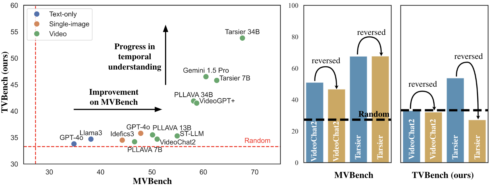
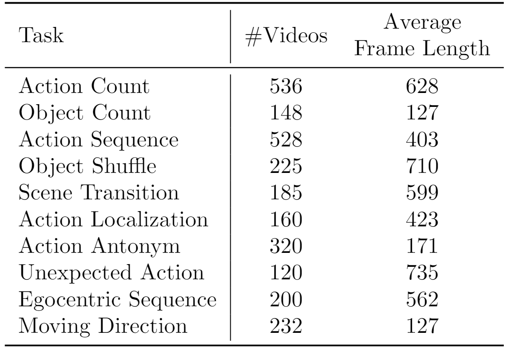
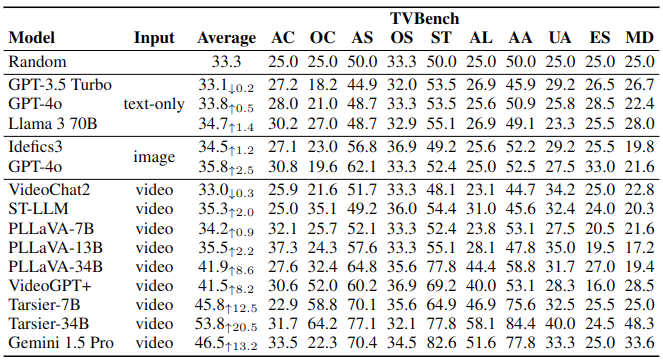

<div align="center">

<h2><a href="https://github.com/daniel-cores/tvbench">TVBench: Redesigning Video-Language Evaluation</a></h2>

[Daniel Cores](https://scholar.google.com/citations?user=pJqkUWgAAAAJ)\*,
[Michael Dorkenwald](https://scholar.google.com/citations?user=KY5nvLUAAAAJ)\*,
[Manuel Mucientes](https://scholar.google.com.vn/citations?user=raiz6p4AAAAJ),
[Cees G. M. Snoek](https://scholar.google.com/citations?user=0uKdbscAAAAJ),
[Yuki M. Asano](https://scholar.google.co.uk/citations?user=CdpLhlgAAAAJ)

*Equal contribution.

[](https://arxiv.org/abs/2410.07752)
[](https://huggingface.co/datasets/FunAILab/TVBench) 
[](https://daniel-cores.github.io/tvbench/)

</div>

This is the official code repository for "TVBench: Redesigning Video-Language Evaluation".

# TVBench
TVBench is a new benchmark specifically created to evaluate temporal understanding in video QA. We identified three main issues in existing datasets: (i) static information from single frames is often sufficient to solve the tasks (ii) the text of the questions and candidate answers is overly informative, allowing models to answer correctly without relying on any visual input (iii) world knowledge alone can answer many of the questions, making the benchmarks a test of knowledge replication rather than visual reasoning. In addition, we found that open-ended question-answering benchmarks for video understanding suffer from similar issues while the automatic evaluation process with LLMs is unreliable, making it an unsuitable alternative.

We defined 10 temporally challenging tasks that either require repetition counting (Action Count), properties about moving objects (Object Shuffle, Object Count, Moving Direction), temporal localization (Action Localization, Unexpected Action), temporal sequential ordering (Action Sequence, Scene Transition, Egocentric Sequence) and distinguishing between temporally hard Action Antonyms such as "Standing up" and "Sitting down".

In TVBench, state-of-the-art text-only, image-based, and most video-language models perform close to random chance, with only the latest strong temporal models, such as Tarsier, outperforming the random baseline. In contrast to MVBench, the performance of these temporal models significantly drops when videos are reversed.



### Dataset statistics:
The table below shows the number of samples and the average frame length for each task in TVBench.

<center>

</center>

## Download and evaluation
TVBench can be downloaded from [here](https://huggingface.co/datasets/FunAILab/TVBench)🤗.

[infer.ipynb](infer.ipynb) contains an example of how to evaluate [VideoChat2](https://github.com/OpenGVLab/Ask-Anything/tree/main/video_chat2) on TVBench. TVBench follows the same format as MVBench, so any codebase with support for MVBench can be directly adapted to TVBench by simply updating the dataset path.


## Leaderboard


# Citation
If you find this benchmark useful, please consider citing:
```

@misc{cores2024tvbench,
  author = {Daniel Cores and Michael Dorkenwald and Manuel Mucientes and Cees G. M. Snoek and Yuki M. Asano},
  title = {TVBench: Redesigning Video-Language Evaluation},
  year = {2024},
  eprint = {arXiv:2410.07752},
}

```
